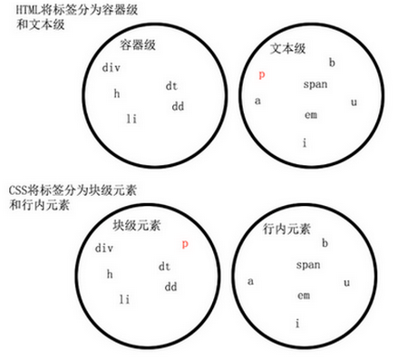
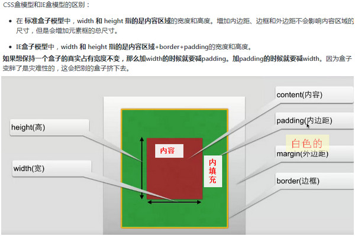

### 1、css3媒体查询
+ css3媒体查询是响应式方案核心
	   
### 2、媒体类型
+ `all`         所有媒体（默认值）
+ `screen`		彩色屏幕
+ `print`		打印预览
	   
+ `projection`		手持设备
+ `tv`              电视
+ `braille`         盲文触觉设备
+ `embossed`     	盲文打印机
+ `speech`        	“听觉”类似的媒体设备
+ `tty`             适用像素的设备
       
### 3、媒体属性
+ `width`				（可加max min前缀）
+ `height`				（可加max min前缀）
+ `device-width`		（可加max min前缀）
+ `device-pixel-ratio`	（可加max min前缀，需要加webkit前缀）
+ orientation   
	- portrait		竖屏
	- landscape		横屏

### 4、操作符，关键字 (only,and,(，or),not)
+ `only`:防止老旧的浏览器  不支持带媒体属性的查询而应用到给定的样式.
	```
	@media only screen and (min-width:800px ){
	   	规则；
	   	规则
	}
	@media  screen and (min-width:800px ){
	   	规则；
	   	规则
	}
	在老款的浏览器下
	@media only    --->    因为没有only这种设备 规则被忽略
	@media screen --->   因为有screen这种设备而且老浏览器会忽略带媒体属性的查询
	   			
	建议在每次抒写media query的时候带上only
	```   	
+ `and`:连接媒体属性 、连接媒体类型对于所有的连接选项都要匹配成功才能应用规则  		
+ `or(,)`: 和and相似对于所有的连接选项只要匹配成功一个就能应用规则
+ `not`:取反

### 5、float:  
+ ☞ 脱离正常文档流，原位置不存在，属性值：left/right/none/
+ ☞ 使块元素在一行显示，使内联支持宽高，默认内容撑开宽度

+ 清除浮动：
    - ☞ 给**父级元素**加 浮动
    - ☞ **父级元素** 加display:inline-block
    - ☞ 给浮动元素父级加：
      {zoom:1;}  
      .clear:after{content: "";display: block;clear: both;}
    - ☞ 给浮动元素的 父级 加  overflow 一定配合zoom:1;
    - ☞ 在IE6，7下父级有宽度就不用清浮动;
    - ☞ 给父级元素加**position:fixed/absolute;**

### 6、position 脱离正常文档流，属性值分为以下情况：
+ 关于位置移动属性值得设置：1.找基准；2.靠近 或 远离，靠近为负值，远离为正值  

+ fix: 相对于浏览器窗口进行定位

+ relative: 不使元素脱离文档流，原位置存在，不影响元素本身特性，**相对直接父级进行定位/相对与原先的位置进行定位**；

+ 注：默认定位后来者层级高于前者

+ absolute: 脱离文档流，原位置不存在，**相对于父级(具有relative/absolute)的元素进行定位**，**若不存在，则相对body进行定位**
    - 使内嵌支持宽高，块属性标签内容撑开宽度

+ 以上可通过z-index进行层次分级，用'left\top\right\bottom'进行规定

### 7、display 属性值：block/inlinle/inline-block

### 8、再提 块标签与内联标签：
+ 块标签：
  - ☞ 常见的块元素：`div, form, table, header, aside, section, article, figure, figcaption, h1~h6, nav, p, pre, blockqoute, canvas, ol, ul, dl`
  - ☞ 默认独占一行 
  - ☞ 没有宽度时，默认撑满一排
  - ☞ 支持所有css命令
+ 内联标签：
  - ☞ 常见的内联元素：`span, a, img, label, input, select, textarea, br, i, em, strong, small, button, sub, sup, code`
  - ☞ 同排可以继续跟同类的标签
  - ☞ 内容撑开宽度
  - ☞ 不支持宽高
  - ☞ 不支持上下的margin和padding
  - ☞ 代码换行被解析  
+ 使图片垂直居中：
  ```
    body:after{
        content:"";
        display:inline-block;
        height:100%;
        vertical-align:middle;
    }
    img{
        vertical-align:middle;
    }
  ```



